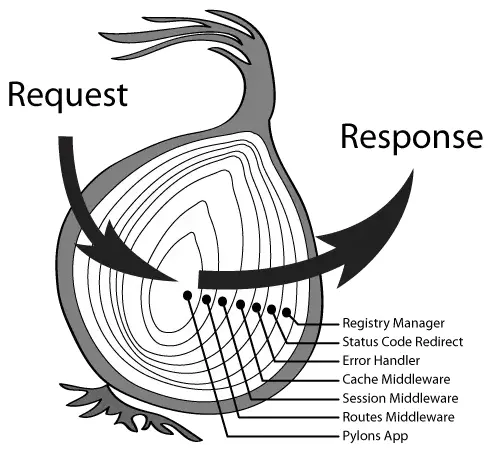

#### koa的请求/响应处理

##### 1、洋葱圈模型


##### 2、理解koa洋葱圈模式的动机

- 一次请求，后端可能会进行多项操作，包括：鉴权、白名单、cookie、异常处理等等，各个操作会具有优先级关系

- 各个操作可能会在其他动作完成后再次调用，比如记录从接收到请求到响应之间的持续时间


##### 3、具体写法
```js
const Koa = require('koa')
const app = new Koa()

const errMiddleWare = async (ctx, next) => {
    try{
        await next()
    }catch(e){
        //do something
    }

}

app.use( async(ctx) => {
    ctx.body = "hello world"
})

app.use(errMiddleWare)
app.listen(1996)
console.log("demo in run")
```

